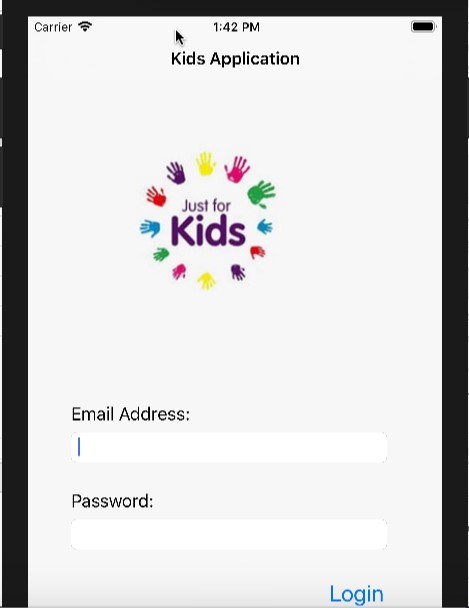

<html>
<body>
<h1>KidsApplication</h1>
<h5>Description</h5> 

This App is made for study issues. It's a simple IOS Application, it uses Swift language and XCode IDE.

This project has some views, controls, table view and other elements.

We tried to do something beautiful and attractive for children to learn alphabet, number and colors.They can tell the name of their favorite story.

Here are some photos from our app.

Log in screen

Home screen

</body>
</html>
